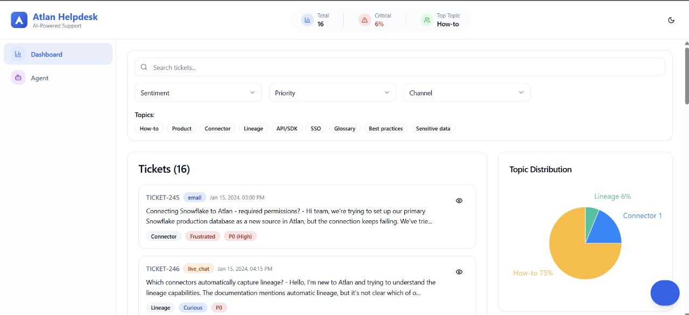
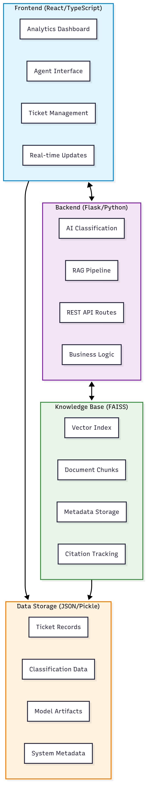
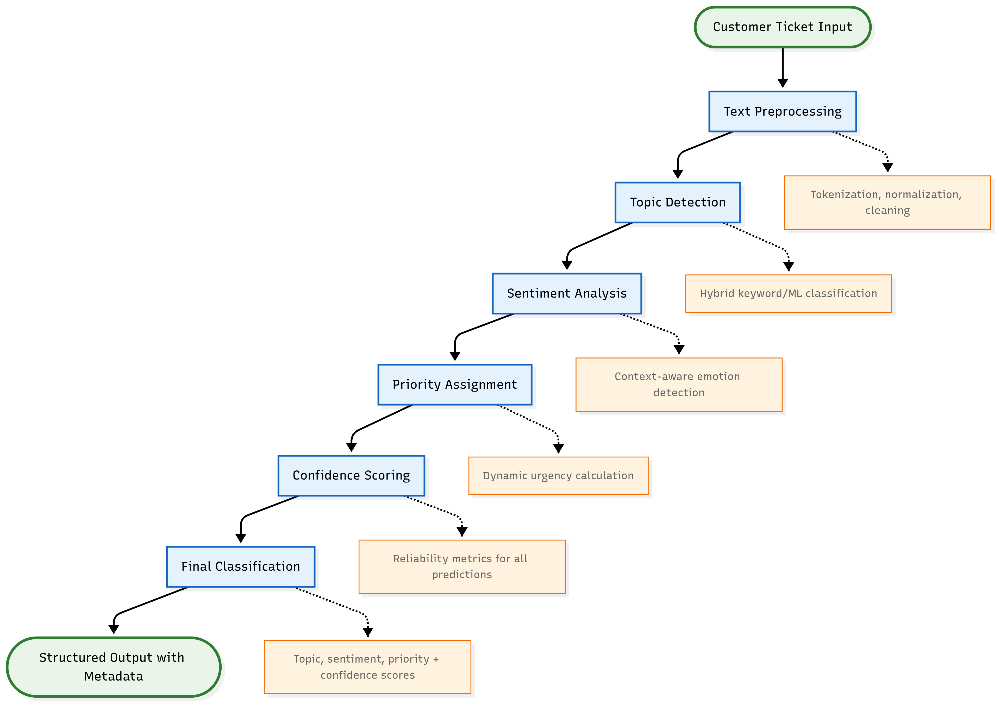
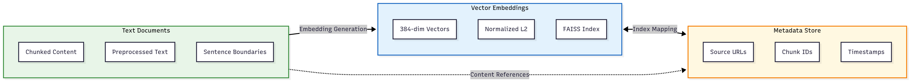
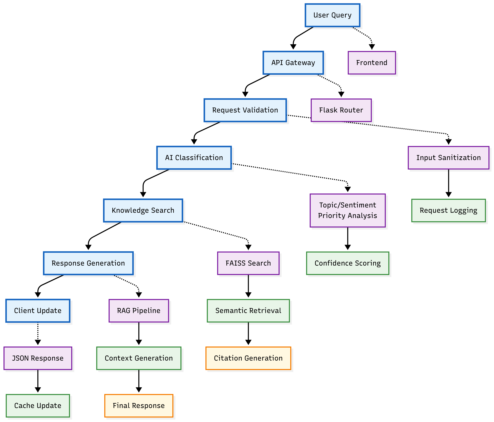
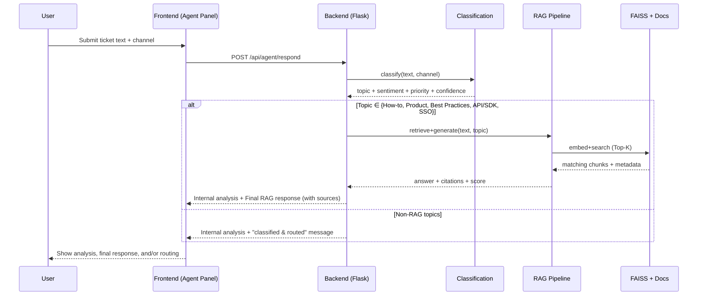

````markdown
# 🤖 Customer Support Copilot — AI-Powered Helpdesk (RAG + Classification)

An intelligent customer support system that **ingests, classifies, prioritizes, and responds** to tickets using AI and **Retrieval-Augmented Generation (RAG)**.  
Purpose-built for **data platform support teams** handling complex technical queries across **email, chat, voice, and WhatsApp**.





---

## 🧭 Context

At **Atlan**, our customer support team is the backbone of customer relationships, handling a spectrum of tickets—from quick _how-to_ questions to deep _technical bug reports_. As volume grows, manual triage, prioritization, and response drafting don’t scale.

**Enter the AI Copilot**: an assistant that automates triage, surfaces the right knowledge with citations, drafts great responses, and routes the rest to the right humans—fast.

---

## ❓ Problem Statement (Challenge)

**Goal:** Build the **core AI pipeline** that can **ingest, classify, and respond** to customer support tickets, showcased through a functional **“dummy helpdesk”** application.

### Required Capabilities

1. **Bulk Ticket Classification Dashboard**

   - Ingest tickets from a `sample_tickets` file on load
   - Display for each ticket:
     - **Topic Tags**: How-to, Product, Connector, Lineage, API/SDK, SSO, Glossary, Best Practices, Sensitive Data
     - **Sentiment**: Frustrated, Curious, Angry, Neutral
     - **Priority**: P0 (High), P1 (Medium), P2 (Low)

2. **Interactive AI Agent**

   - Text input for a new ticket (channels: WhatsApp, email, voice, live chat)
   - **Internal Analysis View**: Topic, Sentiment, Priority
   - **Final Response View**:
     - If Topic ∈ {How-to, Product, Best Practices, API/SDK, SSO} → **RAG** over:
       - **Atlan Documentation**: https://docs.atlan.com/
       - **Developer Hub**: https://developer.atlan.com/
       - **Must cite sources (URLs)**
     - Else → Display “classified and routed” message

3. **Deliverables**
   - Deployed app link
   - GitHub repository
   - Detailed README (this file)

---

## ✅ How We Solved It (Solution Overview)

We implemented a production-style **AI Helpdesk System** centered on the pipeline and wrapped it in a clean, responsive UI to demonstrate end-to-end flows.

### 1) 🧠 AI Classification Engine

- **Topic Detection** across 9 categories using **keyword-seeded, ML-assisted rules**
- **Sentiment Analysis**: Frustrated / Curious / Angry / Neutral
- **Priority Assignment**: P0 / P1 / P2 using urgency & blocker heuristics
- **Multi-Channel Ingestion**: Email, WhatsApp, Voice, Live Chat



### 2) 🔍 RAG Knowledge Base

- **Sentence Transformers + FAISS** for vector search
- **Document Chunking** (size=500, overlap=50) for recall
- **Citations always included** in RAG answers
- **Dynamic Updates**: background indexing
- **Fallback** when confidence is low (safe, honest handoff)



### 3) 📊 Bulk Ticket Dashboard

- Loads `sample_tickets` on app start
- Interactive filters: topic, sentiment, priority, channel
- Visual charts (distribution & trends) and **export**



### 4) 🧭 Specialist Team Routing

- Non-RAG topics (e.g., Connector, Lineage, Sensitive Data) are **classified & routed**
- Clear routing copy and labels for downstream queues

### 5) 🎨 Modern UX

- **React + TypeScript + Vite** with Tailwind and **shadcn/ui**
- **Dark/Light** themes, **WCAG** accessibility, **Framer Motion** micro-interactions
- **React Query** for live, resilient data flows


---

## 🏗️ System Architecture Overview

Our AI-powered helpdesk system consists of several interconnected components working together to provide intelligent customer support automation:

### Architecture Components


### AI Classification Pipeline


### Knowledge Base & RAG System


### Data Processing Pipeline


---

## 🧩 High-Level Architecture

```mermaid
flowchart LR
  U[User (Email / Chat / Voice / WhatsApp)] -->|New Ticket| FE[React + TypeScript UI]

  subgraph Frontend
    FE --> FQ[React Query\n(Data fetching & cache)]
    FE --> Dash[Dashboard & Charts]
    FE --> Agent[Agent Panel]
  end

  FQ -->|REST| BE[(Flask API)]

  subgraph Backend
    BE --> CLF[Classification Engine\n(Topic + Sentiment + Priority)]
    BE --> RAG[RAG Pipeline]
    RAG --> EMB[Sentence Transformers\n(Embeddings)]
    RAG --> IDX[(FAISS Index)]
    RAG --> KB[Docs Loader / Updater]
  end

  KB -->|Docs| DOCS[(docs.atlan.com)]
  KB -->|Dev Hub| DEV[(developer.atlan.com)]

  CLF --> ROUTE[Routing Logic]
  RAG --> RESP[Drafted Response + Citations]
  ROUTE --> RESP
  RESP --> FE
  Dash --> FE
```
````

### Sequence: New Ticket → Response/Routing



---

## 🧪 Design Decisions & Trade-offs

| Area           | Decision                          | Why                                        | Trade-off                                |
| -------------- | --------------------------------- | ------------------------------------------ | ---------------------------------------- |
| Embeddings     | `all-MiniLM-L6-v2`                | Great latency/quality balance              | Slightly lower recall vs. larger models  |
| Index          | FAISS `IndexFlatIP`               | Simple, fast, cosine-like similarity       | Memory grows linearly with corpus        |
| Classification | Keyword-seeded, ML-assisted rules | Deterministic, explainable, domain-tunable | Less adaptive than end-to-end LLMs       |
| Retrieval      | Top-K = 5 + overlap chunking      | Strong recall + low latency                | Multi-hop reasoning not covered          |
| Confidence     | Score thresholds + hygiene        | Reduce hallucinations                      | Conservative handoff on borderline cases |
| UI             | React + shadcn/ui + Recharts      | Dev speed, clean design                    | Opinionated styling system               |

---

## 🎯 Project Overview (What’s Included)

- Intelligent ticket classification (topic/sentiment/priority)
- FAISS-powered RAG (citations, dynamic updates)
- Multi-modal support (email, chat, voice, WhatsApp)
- Real-time analytics dashboard
- Modern React frontend (TypeScript, responsive)

---

## ✨ Core Features (Detailed)

### 🧠 AI Classification Engine

**Topic Detection (9 categories):**

- How-to guides & tutorials
- Product functionality questions
- Connector integration issues
- Data lineage inquiries
- API/SDK development support
- SSO & authentication
- Glossary & metadata management
- Best practices & optimization
- Sensitive data & compliance

**Sentiment:** Frustrated, Curious, Angry, Neutral
**Priority:** P0 / P1 / P2
**Channels:** Email, WhatsApp, Voice, Live Chat

### 🔍 RAG Knowledge Base

- FAISS Vector Search with Sentence Transformers
- Chunking (size=500, overlap=50) for semantic cohesion
- Citations: Always present
- Dynamic Updates: Scheduled re-index
- Fallback: Graceful escalation

### 📊 Analytics Dashboard

- Ticket distribution, trends, and SLAs
- Topic/sentiment/priority breakdowns
- Multi-dimensional filters
- Export for reporting

### 🎨 Modern User Experience

- Responsive (desktop/tablet/mobile)
- Dark/Light themes (system aware)
- Framer Motion animations
- WCAG compliance + keyboard navigation
- Real-time sync with React Query

---

## 🚀 Quick Start

### Prerequisites

- Node.js 18+ and npm/yarn
- Python 3.11+ with pip
- Git
- 4GB+ RAM (FAISS)

### 1) Clone & Install

```bash
git clone https://github.com/your-username/ai-helpdesk-system.git
cd ai-helpdesk-system
npm run install-all
```

### 2) Environment Configuration

```bash
cd backend
cp .env.example .env
# Optional: enhance AI features
echo "GEMINI_API_KEY=your_api_key_here" >> .env
```

### 3) Initialize Knowledge Base

```bash
cd backend
python init_kb.py
```

### 4) Start Development Servers

```bash
npm run dev
```

**Access Points**

- **Frontend** → [http://localhost:5173](http://localhost:5173)
- **Backend API** → [http://localhost:5001](http://localhost:5001)
- **Health** → [http://localhost:5001/api/health](http://localhost:5001/api/health)
- **KB Status** → [http://localhost:5001/api/kb/status](http://localhost:5001/api/kb/status)

### 5) Production Deployment

```bash
npm run build
cd backend
gunicorn -w 4 -b 0.0.0.0:5001 app:app
```

---

## 📱 How to Use

### Dashboard View

The main dashboard shows all tickets with powerful filtering and analytics.


**You can:**

- View classified tickets in an interactive table
- Filter by topic, sentiment, priority, and channel
- Search through ticket content
- Analyze trends with visual charts
- Export data for reporting

### AI Agent Interface

The agent panel processes new tickets and shows classification + response generation in real time.

**Workflow**

1. **Input Ticket**: Paste or type a request
2. **Select Channel**: Email / chat / voice / WhatsApp
3. **Run AI**: Pipeline executes (classification → RAG or routing)
4. **View Results**:

   - **Internal Analysis** (Topic, Sentiment, Priority, Confidence)
   - **Final Response** (RAG with citations) **or** **Routed** notice

5. **History**: Review previous runs

### Specialist Team Routing

For complex queries requiring human expertise, the system routes tickets appropriately.


**Routing Logic**

- **Engineering**: Technical/connector issues
- **Customer Success**: Accounts
- **Finance**: Billing
- **Product**: Product functionality

---

## 🏗️ System Architecture (Code Layout)

### Technology Stack

- **Frontend**: React 18 + TypeScript + Vite
- **UI**: Tailwind CSS + shadcn/ui
- **State**: Zustand + React Query
- **Animations**: Framer Motion
- **Backend**: Flask + Python 3.11
- **AI/ML**: Sentence Transformers + FAISS + scikit-learn
- **Database**: FAISS vector index + JSON storage
- **Deployment**: Gunicorn + Railway/Vercel ready

### Frontend Structure

```
frontend/src/
├── components/
│   ├── ui/              # shadcn/ui base components
│   ├── Dashboard.tsx    # Analytics dashboard
│   ├── AgentPanel.tsx   # AI agent interface
│   ├── TicketTable.tsx  # Data table with filtering
│   ├── Charts.tsx       # Recharts visualizations
│   ├── Header.tsx       # Navigation & theme toggle
│   └── ChatBot.tsx      # Interactive chat interface
├── lib/
│   ├── api.ts           # React Query API client
│   ├── utils.ts         # Utility functions
│   └── types.ts         # Type definitions
├── store/
│   └── ui.ts            # Zustand state
├── hooks/               # Custom hooks
└── App.tsx              # Main app
```

### Backend Structure

```
backend/
├── core/
│   └── ai.py            # Classification algorithms
├── routes/
│   ├── tickets.py       # Ticket CRUD & listing
│   └── agent.py         # AI processing endpoints
├── knowledge_base/
│   ├── documents.pkl    # Chunked docs
│   ├── faiss.index      # FAISS index
│   └── metadata.pkl     # Chunk metadata
├── data/                # Sample data & configs
├── app.py               # Flask application
├── knowledge_base.py    # KB manager (indexing/search)
├── utils.py             # Loaders/scrapers/helpers
└── requirements.txt     # Python dependencies
```

---

## ⚙️ Configuration & Customization

Create `backend/.env`:

```bash
# Server
FLASK_PORT=5001
FLASK_ENV=development
CORS_ORIGIN=http://localhost:5173
PORT=5001

# AI Features
USE_ONLINE_RAG=false
GEMINI_API_KEY=your_api_key_here  # Optional

# Knowledge Base
KB_UPDATE_INTERVAL=3600
FAISS_INDEX_TYPE=IndexFlatIP
SENTENCE_MODEL=all-MiniLM-L6-v2

# Retrieval
MAX_CHUNK_SIZE=500
CHUNK_OVERLAP=50
TOP_K_RESULTS=5
```

### AI Classification Customization (`backend/core/ai.py`)

```python
TOPIC_KEYWORDS = {
    'How-to': ['how', 'tutorial', 'guide', 'setup'],
    'Product': ['feature', 'functionality', 'capability'],
    'Connector': ['connector', 'integration', 'source'],
    'Lineage': ['lineage', 'impact', 'provenance'],
    'API/SDK': ['api', 'sdk', 'token', 'endpoint'],
    'SSO': ['sso', 'saml', 'okta', 'authentication'],
    'Glossary': ['glossary', 'term', 'metadata'],
    'Best Practices': ['optimize', 'recommendation', 'best practice'],
    'Sensitive Data': ['pii', 'compliance', 'gdpr'],
}

SENTIMENT_KEYWORDS = {
    'Frustrated': ['blocked', 'stuck', 'not working', 'issue'],
    'Angry': ['terrible', 'awful', 'unacceptable'],
    'Curious': ['wondering', 'interested', 'learn', 'how do i'],
    'Neutral': []
}

PRIORITY_KEYWORDS = {
    'P0': ['down', 'production', 'critical', 'blocker', 'outage'],
    'P1': ['important', 'asap', 'urgent', 'high priority'],
    'P2': ['when possible', 'nice to have', 'low priority']
}
```

### Knowledge Base Sources (`utils.py`)

```python
DOC_SOURCES = [
  'https://docs.atlan.com/',
  'https://developer.atlan.com/'
]
```

### Response Templates

```python
RESPONSE_TEMPLATES = {
  "rag": "Based on our documentation:\n\n{response}\n\n📚 Sources: {citations}",
  "routing": "This ticket has been classified as '{topic}' and routed to the {team} team.",
  "fallback": "I don't have specific information about this. Connecting you with a specialist."
}
```

---

## 📊 API Documentation

### Health & Status

```http
GET /api/health
GET /api/kb/status
```

### Ticket Management

```http
GET /api/tickets
```

**Sample Response**

```json
{
  "tickets": [
    {
      "id": "TICKET-245",
      "channel": "email",
      "createdAt": "2024-01-15T09:30:00Z",
      "subject": "Connecting Snowflake to Atlan",
      "body": "Hi team, we're trying to set up our Snowflake...",
      "classification": {
        "topic": "Connector",
        "sentiment": "Frustrated",
        "priority": "P1",
        "confidence": 0.89
      }
    }
  ],
  "total": 16,
  "page": 1,
  "per_page": 50
}
```

### Classification

```http
POST /api/classify
Content-Type: application/json
```

**Sample Response**

```json
{
  "classification": {
    "topic": "Connector",
    "sentiment": "Frustrated",
    "priority": "P2",
    "confidence": 0.76,
    "reasoning": {
      "topic_keywords": ["tableau", "connection", "trouble"],
      "sentiment_indicators": ["trouble", "having"],
      "priority_factors": ["connection issue"]
    }
  },
  "processing_time": 0.23
}
```

### AI Agent (RAG or Routing)

```http
POST /api/agent/respond
Content-Type: application/json
```

**Sample Response**

```json
{
  "analysis": {
    "topic": "SSO",
    "sentiment": "Curious",
    "priority": "P1",
    "confidence": 0.94
  },
  "response": "To set up SSO with Okta in Atlan:\n\n1. Navigate to Admin Settings > Authentication\n2. Select 'SAML 2.0' as your SSO provider\n3. Configure the following Okta settings...",
  "sources": [
    "https://docs.atlan.com/sso/okta-setup",
    "https://docs.atlan.com/admin/authentication"
  ],
  "type": "rag",
  "confidence": 0.91,
  "processing_time": 1.45
}
```

### Knowledge Base Search

```http
POST /api/kb/search
Content-Type: application/json
```

**Sample Response**

```json
{
  "results": [
    {
      "content": "To connect Snowflake to Atlan, ensure your service account has the following permissions...",
      "source": "https://docs.atlan.com/connectors/snowflake",
      "similarity": 0.87,
      "chunk_id": "snowflake_permissions_001"
    }
  ],
  "query_time": 0.12
}
```

### Error Handling (Standardized)

```json
{
  "error": "Invalid request format",
  "code": "VALIDATION_ERROR",
  "details": { "field": "text", "message": "Text field is required" },
  "timestamp": "2024-01-15T10:30:00Z"
}
```

---

## 🧪 Sample Data & Testing

### Pre-loaded Sample Tickets (16)

- **Connector Integration (5)**: Snowflake setup, Tableau lineage, Redshift config, On-prem Data Lake (VPC + Agent), Fivetran lineage
- **Data Management (4)**: Lineage export (compliance), Airflow DAG mapping, Visual Query Builder, Schema evolution
- **Authentication & Security (3)**: SSO, API auth, Data governance
- **User Experience (4)**: Performance, Mobile access, Training resources, Feature requests

### Manual Testing

```bash
curl http://localhost:5001/api/health
curl http://localhost:5001/api/tickets

curl -X POST http://localhost:5001/api/classify \
  -H "Content-Type: application/json" \
  -d '{"text": "How do I connect Snowflake?", "channel": "email"}'
```

### Automated Testing

```bash
# Backend
cd backend
python -m pytest tests/ -v

# Frontend
cd ../frontend
npm run test

# Integration
npm run test:integration
```

### Load Testing

```bash
python backend/test_rag.py
python backend/test_simple.py
```

---

## 🛠️ Development Guide

```bash
# All services
npm run dev

# Individually
cd backend && python app.py
cd frontend && npm run dev
```

### Code Quality

**Frontend (TypeScript/React)**

```bash
npm run lint
npm run lint:fix
npm run format
npm run type-check
npm run test
npm run test:watch
npm run test:coverage
```

**Backend (Python/Flask)**

```bash
black .
isort .
flake8 .
mypy .
pytest -v
pytest --cov=.
```

---

## 🚀 Deployment Options

### Railway (Recommended)

```bash
railway login
railway init
railway up
```

`railway.json`

```json
{
  "build": { "builder": "NIXPACKS" },
  "deploy": {
    "startCommand": "cd backend && gunicorn -w 4 -b 0.0.0.0:$PORT app:app",
    "healthcheckPath": "/api/health"
  }
}
```

### Vercel (Frontend)

```bash
npm i -g vercel
cd frontend
vercel --prod
```

### Docker

```dockerfile
FROM python:3.11-slim

WORKDIR /app
COPY backend/ ./backend/
COPY frontend/dist/ ./backend/static/

RUN pip install -r backend/requirements.txt
RUN cd backend && python init_kb.py

EXPOSE 5001
CMD ["gunicorn","-w","4","-b","0.0.0.0:5001","backend.app:app"]
```

---

## 🔒 Security, Privacy & Safety

- Optional PII redaction before indexing
- Allowlist RAG sources (docs.atlan.com, developer.atlan.com)
- Deterministic routing copy for non-RAG topics
- Configurable confidence thresholds for safe answers

---

## 📊 Evaluation Mapping (How This Meets the Rubric)

| Criterion                      | How We Address It                                                                 |
| ------------------------------ | --------------------------------------------------------------------------------- |
| **Core Features**              | Bulk classification dashboard + interactive agent + routing + RAG with citations  |
| **Problem Solving & Approach** | Modular pipeline, explainable classification, pragmatic retrieval, safe fallbacks |
| **Accuracy of Answers**        | Embedding search + Top-K + thresholds + explicit citations                        |
| **Maintainability**            | Clean foldering, configurable keywords, typed frontend, tests & linting           |
| **Communication**              | This README + diagrams + step-by-step flows                                       |

---

## 🗺️ Roadmap

- Re-ranker + multi-hop RAG
- Distilled LLM classifier (fallback/ensemble)
- Human-in-the-loop approval queue
- Confidence-aware UI (traffic-light)
- Multi-tenant KB & scoped auth

---

## 🤝 Contributing

**Process**

1. Fork the repo
2. Create a feature branch: `git checkout -b feature/amazing-feature`
3. Make changes + tests
4. `npm run test` / `pytest`
5. Open a PR with context and screenshots

**Guidelines**

- Follow linting/formatting rules
- Write tests for new logic
- Update docs where relevant
- Consider performance & KB cost

---

## 📝 License & Third-Party

**MIT License** — see [LICENSE](LICENSE).

- React (MIT), Flask (BSD-3-Clause), FAISS (MIT), Sentence Transformers (Apache-2.0), shadcn/ui (MIT), Recharts (MIT)

---

## 🙏 Acknowledgments

- **FAISS**
- **Sentence Transformers**
- **React Query**
- **shadcn/ui**
- **Framer Motion**
- **Recharts**
- **Atlan Documentation & Developer Hub** for domain context

---

## 📞 Support & Community

- Read this README & inline comments
- Search or open issues: [https://github.com/your-username/ai-helpdesk-system/issues](https://github.com/your-username/ai-helpdesk-system/issues)
- Start a discussion for ideas and feedback

```

```
